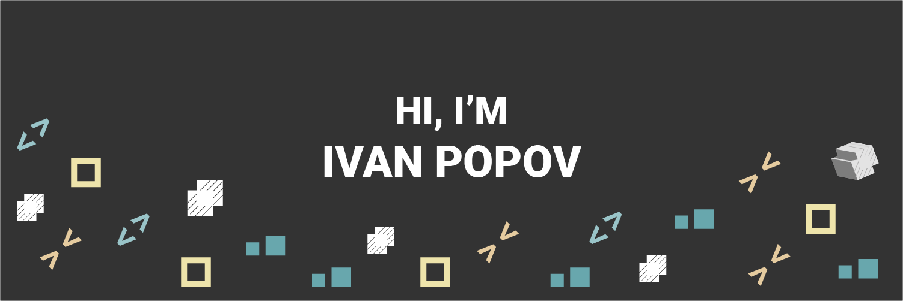

[]

Hey there 👋

I’m Ivan, a junior full-stack engineer, who specializes in Python and Django framework.
I make it my mission to create perfect scaling international application!

Want to know more about me? Check out my terminal like [portfolio](https://impopov.vercel.app).

## 💼 Skills

